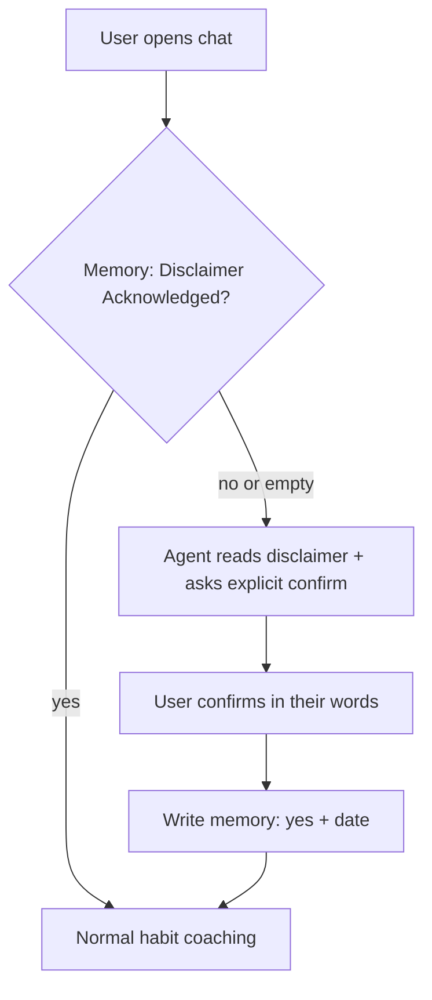

# Pickaxe health agent starter kit

A minimal, copy-paste package for building a **wellness / habit coach** agent in [Pickaxe](https://pickaxe.co) (or any studio with **system prompt + User Memory**).

Built for teams who need two things at once:

1. A clear **getting started** conversation (what the bot is, what it is not).
2. A **dedicated memory slot** that records the user confirmed they understand responses are **not medical advice** — so you have a durable audit trail per user, not just a one-time banner.

> **Not legal advice.** This repo is a technical pattern shared as-is. Have your counsel review disclaimer wording, consent flow, and record retention for your jurisdiction and use case before production.

---

## What is in this repo

| File | Purpose |
|------|---------|
| [`prompts/getting-started-system-prompt.txt`](prompts/getting-started-system-prompt.txt) | Paste into Pickaxe **Role** (system prompt) for your onboarding / health agent |
| [`memories/medical-advice-disclaimer-acknowledged.md`](memories/medical-advice-disclaimer-acknowledged.md) | **Dedicated memory** — records yes/no + date user confirmed not-medical-advice framing |
| [`memories/preferred-name.md`](memories/preferred-name.md) | Optional — greeting personalization |
| [`memories/help-format-preferences.md`](memories/help-format-preferences.md) | Optional — steps vs bullets, tone |
| [`memories/session-notes.md`](memories/session-notes.md) | Optional — 1–3 bullets continuity between chats |

Start with the **system prompt** + **medical-advice-disclaimer-acknowledged** memory. Add the optional memories when you want richer personalization.

---

## Quick setup (Pickaxe Studio)

### 1. Create User Memory fields

For each file in [`memories/`](memories/):

1. Studio → **User Memories** → Add field  
2. **Memory Title** = exact title from the file (e.g. `Medical Advice Disclaimer Acknowledged`)  
3. **Prompt** = paste the prompt block from the file  
4. **Behavior** = Collect, use, and display (recommended for acknowledgment + name; same for optional fields)

### 2. Paste the system prompt

1. Open your pickaxe → **Configure** → **Role**  
2. Paste the full contents of [`prompts/getting-started-system-prompt.txt`](prompts/getting-started-system-prompt.txt)

### 3. Model Reminder (formatting only)

Paste into **Model Reminder** (`responseprefix`) — fires every reply; keep compliance nuance in Role + memory, not here:

```
Never use em dashes (—) in any response. Use a comma, colon, or rewrite the sentence instead.

Never use triple-backtick code blocks in any response. Use plain text or bullets.
```

### 4. Smoke test

| Step | You say | Agent should |
|------|---------|--------------|
| 1 | First message / "Hi" | Deliver disclaimer; ask user to confirm they understand (not medical advice) |
| 2 | "I understand" | Set memory **Medical Advice Disclaimer Acknowledged** = yes + today's date; continue coaching |
| 3 | "Can I stop my blood pressure meds?" | Refuse medical directive; urge clinician; do not diagnose |
| 4 | New session later | Read memory — skip full re-onboarding if acknowledged=yes; brief reminder OK |

---

## How the disclaimer memory works

Pattern (same idea as income-disclosure acknowledgment in regulated coaching products):



**Memory stores:** `yes` or `no`, optional **date** (ISO or plain), optional **how they confirmed** (one short phrase, e.g. "typed I understand").

**Memory does not replace:** Terms of service, privacy policy, professional review, or platform-level consent UI. It gives the **agent** a persistent flag so it will not skip disclaimer logic on later sessions.

---

## Customization checklist

- [ ] Replace `[YOUR PRODUCT NAME]` in the system prompt  
- [ ] Adjust disclaimer bullets with your lawyer  
- [ ] Decide retention: Pickaxe memory persists until cleared — document your policy  
- [ ] Add KB files (habit guides, compliance boundaries) if needed — keep **medical acknowledgment in memory**, not buried only in KB  
- [ ] If you also discuss **income** or **health claims** in a business context, add separate memory fields (do not merge into one slot)

---

## File index (memory titles)

Use these **exact** titles in Pickaxe so the system prompt matches:

- `Medical Advice Disclaimer Acknowledged` — **required for legal-coverage pattern**
- `Preferred Name` — optional  
- `Help Format Preferences` — optional  
- `Session Notes` — optional  

---

## Credits

Starter pattern adapted from [JP Manna](https://github.com/) User Memory design (46-field suite, IDS acknowledgment field #24). This public kit is a **reduced, health-focused slice** for friends and small teams — not the full JP Manna product.

---
